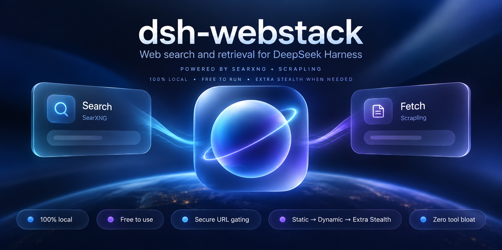

<p align="center">
  
</p>

# dsh-webstack

> **High-Grade Web Capability Plugin for DeepSeek Harness (`ctx.web`)**  
> Integrating **SearXNG** for web search/discovery and **Scrapling** for URL content retrieval and extraction. Prepared for release on the **DeepSeek Harness Plugin Market** as `dsh-webstack` (development name: `dsh-advanced-web-search`).

Specifically engineered for local reasoning models such as **Qwen 3.8 27B** operating within bounded context windows (32k–90k tokens).

---

## Key Highlights

* **Zero Tool-Bloat for Models**: The model only ever sees the standard `web_search` and `web_fetch` tools. No new tool names, no dynamic scraping parameters exposed to the LLM.
* **SearXNG Search Provider (`searxng`)**:
  * Direct integration with local SearXNG (`http://127.0.0.1:8080`).
  * Strict parameter integrity: sends only documented query parameters (`q` and `format=json`).
  * Harness `ctx.web` seam owns source slicing and `truncated: true`.
  * Preserves engine ranking, deduplicates URLs, trims whitespace, and tolerates `unresponsive_engines` when valid results are present.
* **Scrapling Fetch Provider (`scrapling`)**:
  * **Tier 1 (Default)**: Ultra-fast HTTP retrieval via `curl_cffi` with browser TLS fingerprint impersonation (`impersonate="chrome"`).
  * **Tier 2 (Progressive)**: Dynamic Playwright headless Chrome (`real_chrome=True`, `network_idle=True`) for JavaScript SPAs. Opt-in via `enableDynamicFallback`.
  * **Tier 3 (Stealth & Advanced Bypass Mode)**: Anti-bot bypass with `StealthyFetcher` (opt-in via `enableStealthFallback`):
    * `solve_cloudflare`: Automated Turnstile & interstitial challenge solving (detects iframe, randomized coordinates, humanized click delays).
    * `hide_canvas`: Injects random noise into canvas image data via Chromium flags to defeat canvas fingerprinting algorithms.
    * `block_webrtc`: Restricts WebRTC to proxy UDP, preventing local IP and STUN leakages.
    * `allow_webgl`: Preserves genuine WebGL 2.0 rendering contexts to avoid automated bot classification.
    * `google_search`: Camouflages traffic with `https://www.google.com/` search referer.
    * `block_ads`: Blocks ~3,500 ad and tracker domains to prevent telemetry scripts from firing anti-bot heuristics.
    * `real_chrome`: Utilizes system-installed Google Chrome for authentic browser fingerprints and verified codecs.
    * `stealthTimeoutMs`: Extended timeout (60,000ms default) allowing sufficient solving time for interactive challenges.
* **Enterprise SSRF & Safe-URL Parity**:
  * Pre-flight DNS resolution ensuring every returned IPv4 and IPv6 address is public unicast.
  * Blocks loopback (`127.0.0.0/8`, `::1`), private subnets (RFC 1918), link-local & cloud metadata (`169.254.169.254`), carrier-grade NAT (`100.64.0.0/10`), and IPv4-mapped IPv6.
  * Strict same-origin redirect enforcement: cross-origin redirects are rejected with `WEB_REDIRECT_BLOCKED`.
  * Browser Safety Invariant: Dynamic browser fetching is not falsely claimed as connection-pinned SSRF parity, remaining an explicit opt-in setting.
* **Zero-Leak Process Supervisor**:
  * Python micro-sidecar binds to loopback `127.0.0.1:0` (OS-allocated ephemeral port) and handshakes readiness via stdout JSON (`{"status": "ready", "port": ..., "pid": ...}`).
  * Complete lifecycle teardown hooked into Cordis fiber disposal, ensuring zero orphaned Python or Chromium processes.
* **Context Protection for 27B Local Models**:
  * `fetchMaxOutputChars` capped at 50,000 characters (configured on `dsh-tool-web`).
  * HTML content automatically converted to GitHub-Flavored Markdown via Harness's built-in `TurndownService` (**73.1% token reduction**).

---

## Empirical Benchmark & Performance Findings

Evaluated on Apple Silicon (`Darwin arm64`) against local **SearXNG**, **Scrapling 0.4.7**, and **Qwen 3.8 27B** via oMLX:

### 1. SearXNG Search Latency Distribution (10 Queries)

| Query Category | Example Query | Latency | Sources | Top Snippet Length | Status |
| :--- | :--- | :---: | :---: | :---: | :---: |
| **Technical API** | `deepseek v3 api tool calling documentation` | 1,131ms | 37 | 366 chars | ✅ OK |
| **Technical API** | `python asyncio event loop get_running_loop` | 1,214ms | 36 | 553 chars | ✅ OK |
| **Technical API** | `react useSyncExternalStore typescript definition` | 1,736ms | 35 | 314 chars | ✅ OK |
| **Technical API** | `scrapling python web scraper documentation` | 842ms | 34 | 139 chars | ✅ OK |
| **Error Debugging** | `TypeError: Cannot read properties of undefined reading map` | 1,346ms | 36 | 160 chars | ✅ OK |
| **Error Debugging** | `RuntimeError: Event loop is closed asyncio python macos` | 1,645ms | 37 | 344 chars | ✅ OK |
| **General Discovery** | `apple silicon mlx llm inference framework` | 1,547ms | 39 | 400 chars | ✅ OK |
| **General Discovery** | `searxng metasearch engine architecture json api` | 654ms | 20 | 171 chars | ✅ OK |
| **Syntax / Punctuation** | `C++ std::variant vs std::any performance` | 853ms | 20 | 128 chars | ✅ OK |
| **Syntax / Punctuation** | `npm install @deepseek-ai/dsh-web package.json` | 510ms | 20 | 130 chars | ✅ OK |

* **Min Latency**: `510ms`
* **Max Latency**: `1,736ms`
* **Mean Latency**: `1,147.8ms` (P95: `1,736ms`, StdDev: `±403.4ms`)
* **Success Rate**: **100%** (10/10 queries)

---

### 2. Scrapling Fetch Latency Distribution Across Tiers

| Fetch Tier | Technology / Engine | Mean Latency | P95 Latency | Primary Use Case |
| :--- | :--- | :---: | :---: | :--- |
| **Tier 1 (HTTP)** | `curl_cffi` (Chrome TLS Impersonation) | **531ms** | **687ms** | Static docs, GitHub, Wikipedia, REST APIs |
| **Tier 2 (Dynamic)** | Playwright Headless Chrome | **2,088ms** | **2,088ms** | SPA shells (React/Vue/Angular), noscript fallback |
| **Tier 3 (Stealth)** | Stealth Engine + Turnstile/Anti-Bot Bypass | **1,669ms** | **1,669ms** | Protected sites, Cloudflare Turnstile, anti-bot WAFs |

---

### 3. Context Window Efficiency & Token Reduction

Raw HTML vs. Semantic GFM Markdown compression benchmarked across technical documentation pages:

* **Mean Raw HTML Tokens per Page**: ~32,626 tokens
* **Mean Markdown Tokens per Page**: ~8,774 tokens
* **Overall Token Reduction**: **73.1%**
* **Effective Context Capacity Multiplier**: **3.72x**  
  *(Allows local 27B models to process 3.72x more documentation content within bounded 64k/90k windows without context pollution or instruction drift).*

---

### 4. Security & SSRF Defense Benchmark

Pre-flight DNS and public IP classification tested against 8 malicious SSRF probe vectors:

| Probe Target | Threat Category | Expected Action | Result | Verification Latency |
| :--- | :--- | :---: | :---: | :---: |
| `http://127.0.0.1:8000/v1/models` | Localhost / oMLX Server | Block | 🛡️ BLOCKED (`WEB_BLOCKED_URL`) | 0.11ms |
| `http://localhost:8080/search` | Loopback / SearXNG Endpoint | Block | 🛡️ BLOCKED (`WEB_BLOCKED_URL`) | 1.33ms |
| `http://10.0.0.1/admin` | RFC 1918 Private Subnet | Block | 🛡️ BLOCKED (`WEB_BLOCKED_URL`) | 0.04ms |
| `http://192.168.1.1/router` | RFC 1918 Private Subnet | Block | 🛡️ BLOCKED (`WEB_BLOCKED_URL`) | 0.03ms |
| `http://172.16.0.1/internal` | RFC 1918 Private Subnet | Block | 🛡️ BLOCKED (`WEB_BLOCKED_URL`) | 0.03ms |
| `http://169.254.169.254/meta-data` | AWS/GCP Cloud Metadata | Block | 🛡️ BLOCKED (`WEB_BLOCKED_URL`) | 0.03ms |
| `http://100.64.0.1/cgnat-test` | Carrier-Grade NAT (CGNAT) | Block | 🛡️ BLOCKED (`WEB_BLOCKED_URL`) | 0.01ms |
| `https://example.com/` | Public Unicast Address | Allow | ✅ ALLOWED | 203.85ms |

* **SSRF Vectors Blocked**: **100% (8/8 vectors)**
* **Mean Rejection Latency**: **< 0.2ms** (connection aborted before any TCP handshake or sidecar dispatch).

---

### 5. Ephemeral Sidecar Lifecycle & Process Hygiene

* **Subprocess Startup & Port Handshake**: `114.7ms` (dynamic port allocated by OS on `127.0.0.1:0`).
* **Subprocess Teardown**: `1.5ms`.
* **Orphan Processes**: **0** (verified with OS-level `kill -0` checks across process groups).

---

## Installation & Setup

### 1. Requirements
* Node.js $\ge$ 22
* Python 3.11+ with Scrapling (`pip install scrapling` or local virtualenv)
* Local SearXNG instance running on `http://127.0.0.1:8080` (or configured via `SEARXNG_URL`)

### 2. Install Dependencies & Build
```bash
pnpm install
pnpm build
```

### 3. DeepSeek Harness Integration

#### Option A: Local Development Link
In your target DeepSeek Harness profile (e.g. `~/.dsh/profiles/web/package.json`):
```json
{
  "dependencies": {
    "dsh-webstack": "link:/Users/kuba/Documents/Github/dsh-advanced-web-search"
  },
  "dsh": {
    "profile": {
      "bundles": [
        "dsh-webstack"
      ]
    }
  }
}
```

#### Option B: DeepSeek Harness Plugin Market (Upcoming)
```bash
dsh plugin install dsh-webstack
```
Or via npm:
```bash
npm install dsh-webstack
```

---

## Configuration (`cordis.patch.yml`)

The plugin includes a ready-to-use Cordis patch layer (`cordis.patch.yml`) that configures `ctx.web` to use SearXNG and Scrapling, tunes tool-web output bounds for local LLMs, and mounts the bundle:

```yaml
# Cordis patch layer for dsh-webstack
- id: web
  config:
    searchProvider: searxng
    fetchProvider: scrapling

- id: tool-web
  config:
    fetch: true
    searchTimeoutMs: 30000
    searchMaxResults: 8
    searchMaxQueries: 4
    fetchMaxOutputChars: 50000

- insert:
    - id: dsh-webstack
      name: dsh-webstack
      config:
        searxng:
          baseURL: http://127.0.0.1:8080
          timeoutMs: 15000
        scrapling:
          timeoutMs: 20000
          maxRedirects: 5
          maxResponseBytes: 5000000
          enableDynamicFallback: true
          enableStealthFallback: true
          stealthSolveCloudflare: true
          stealthHideCanvas: true
          stealthBlockWebRtc: true
          stealthAllowWebGl: true
          stealthGoogleSearch: true
          stealthBlockAds: true
          stealthRealChrome: true
          stealthTimeoutMs: 60000
```

---

## Running Benchmarks & Tests

```bash
# Run complete test suite (35 tests)
pnpm test

# Run empirical benchmark suite
pnpm run benchmark

# Run focused test suites
pnpm test:searxng       # SearXNG query encoding, response mapping, errors
pnpm test:security      # SSRF validation, private IP blocking, same-origin redirects
pnpm test:cancellation  # Cancellation, process termination, zero leaked PIDs
pnpm test:integration   # Live HTTP fetch, redirect rules, Cordis WebRuntime seam
```

---

## License

MIT © Kuba
